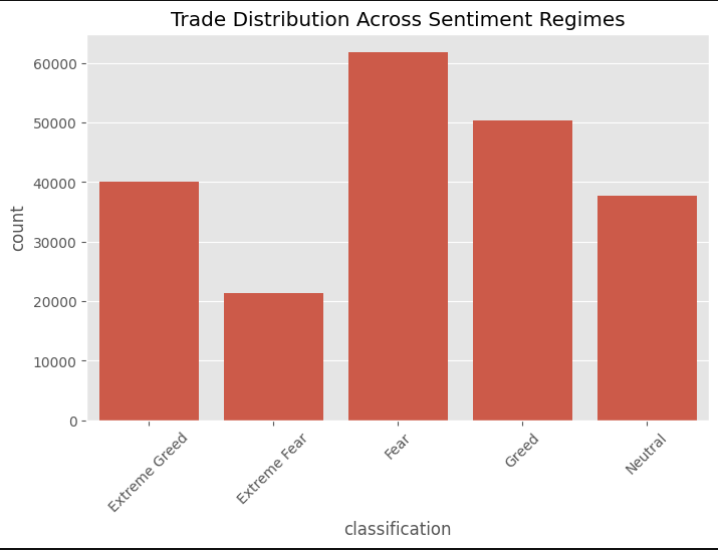
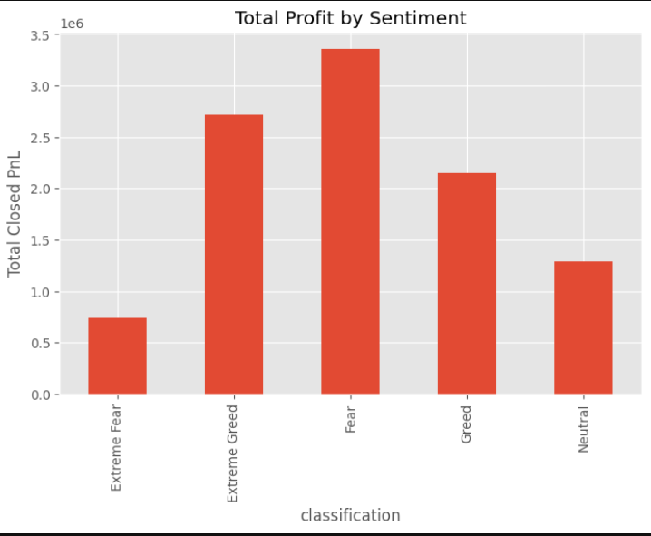
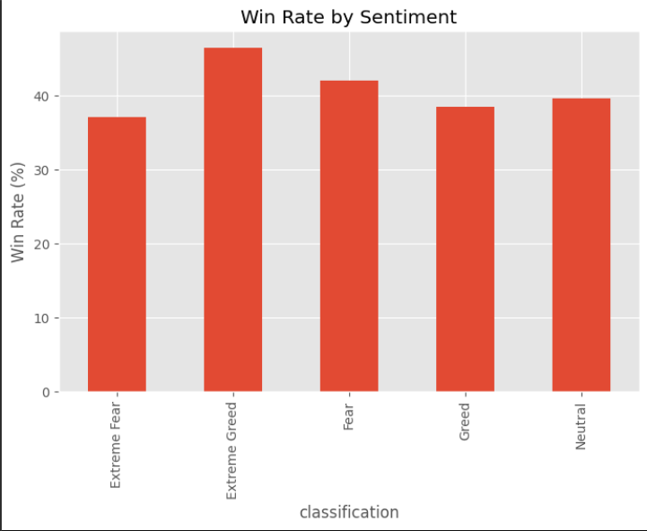
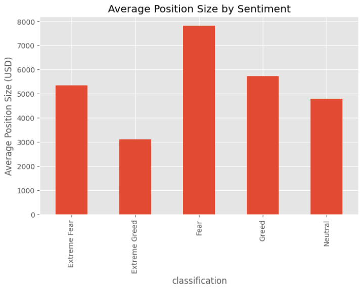
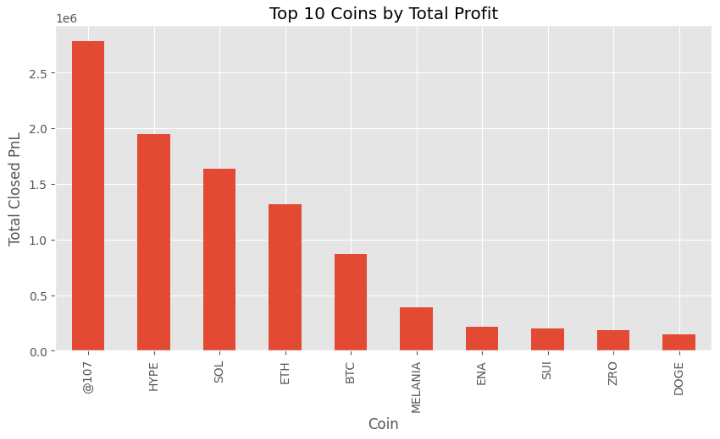
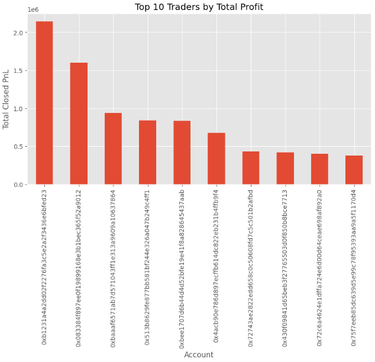
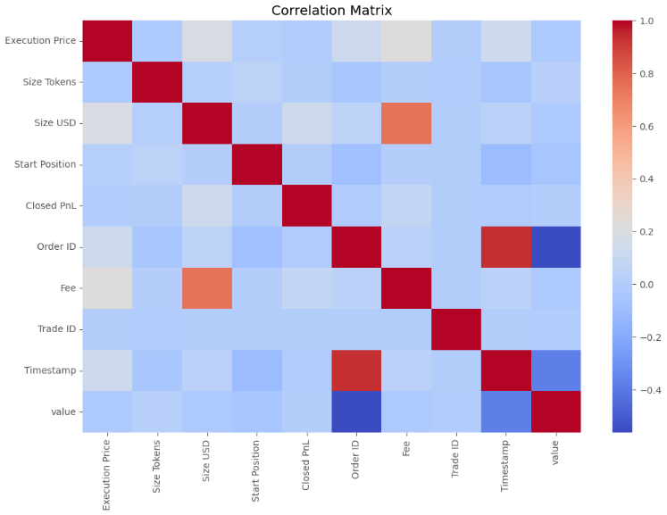

# Bitcoin Market Sentiment vs Trader Performance Analysis

## Overview

This project investigates the relationship between **Bitcoin market sentiment** and **trader performance** using:

* Bitcoin Fear & Greed Index
* Hyperliquid Historical Trading Data

The objective is to determine whether market sentiment influences:

* Trader profitability
* Win rates
* Risk-taking behavior
* Asset-level performance
* Trading strategy effectiveness

A total of **211,224 trades** were analyzed and matched with daily market sentiment classifications.

---

# Business Problem

Cryptocurrency markets are heavily influenced by investor psychology.

The Bitcoin Fear & Greed Index is widely used to measure overall market sentiment and classify market conditions into:

* Extreme Fear
* Fear
* Neutral
* Greed
* Extreme Greed

This project explores whether traders perform differently under these sentiment regimes and whether sentiment can be incorporated into smarter trading strategies.

---

# Dataset Information

## Dataset 1: Bitcoin Fear & Greed Index

Features:

* Date
* Sentiment Classification
* Fear & Greed Score

## Dataset 2: Hyperliquid Historical Trades

Features:

* Account
* Coin
* Execution Price
* Trade Size
* Trade Direction
* Closed Profit & Loss (PnL)
* Fees
* Timestamp

---

# Methodology

The analysis followed the following pipeline:

### 1. Data Cleaning

* Timestamp conversion
* Missing value inspection
* Data validation

### 2. Data Preparation

* Standardized dates
* Created common merge key
* Joined sentiment data with trading data

### 3. Exploratory Data Analysis

* Trade distribution
* Sentiment distribution
* Profitability analysis

### 4. Performance Analysis

* Average PnL
* Total PnL
* Win Rates
* Position Size Behavior

### 5. Advanced Analysis

* Coin-level profitability
* Trader-level profitability
* Profit concentration
* Correlation analysis

---

# Repository Structure

```text
bitcoin-sentiment-trader-analysis
│
├── data/
│   ├── historical_data.csv
│   └── fear_greed_index.csv
│
├── notebook/
│   └── Bitcoin_Sentiment_Analysis.ipynb
│
├── images/
│   ├── trade_distribution.png
│   ├── profit_by_sentiment.png
│   ├── win_rate_by_sentiment.png
│   ├── position_size_by_sentiment.png
│   ├── top_coins_profit.png
│   ├── top_traders_profit.png
│   └── correlation_heatmap.png
│
├── report.pdf
├── requirements.txt
└── README.md
```

---

# Key Findings

## 1. Extreme Greed Produced Highest Average Profitability

| Sentiment     | Average PnL |
| ------------- | ----------: |
| Extreme Greed |       67.89 |
| Fear          |       54.29 |
| Greed         |       42.74 |
| Extreme Fear  |       34.54 |
| Neutral       |       34.31 |

### Insight

Bullish market conditions create the most favorable environment for profitable trading.

Traders generated nearly twice the average profit during Extreme Greed compared with Neutral sentiment periods.

---

## 2. Fear Generated Highest Aggregate Profit

| Sentiment     |    Total PnL |
| ------------- | -----------: |
| Fear          | 3.36 Million |
| Extreme Greed | 2.72 Million |
| Greed         | 2.15 Million |

### Insight

Although average profitability peaks during Extreme Greed, Fear periods generate a larger volume of profitable opportunities.

---

## 3. Traders Deploy More Capital During Fear

| Sentiment     | Average Position Size (USD) |
| ------------- | --------------------------: |
| Fear          |                       7,816 |
| Greed         |                       5,737 |
| Extreme Fear  |                       5,350 |
| Neutral       |                       4,783 |
| Extreme Greed |                       3,112 |

### Insight

Traders appear willing to deploy larger amounts of capital during fearful market conditions, potentially accumulating assets at discounted prices.

---

## 4. Win Rates Improve During Extreme Greed

| Sentiment     | Win Rate |
| ------------- | -------: |
| Extreme Greed |   46.49% |
| Fear          |   42.08% |
| Neutral       |   39.70% |
| Greed         |   38.48% |
| Extreme Fear  |   37.06% |

### Insight

Positive sentiment improves trade success rates.

---

## 5. Profitability Is Driven by a Small Fraction of Trades

### Observation

* 50.57% of trades closed with zero realized profit.
* Median PnL = 0.

### Insight

Overall profitability is driven by a relatively small number of highly successful trades rather than consistent profits across the majority of positions.

---

## 6. BTC, ETH, and SOL Demonstrated Strong Performance

These assets remained profitable across multiple sentiment regimes.

### Insight

Large-cap assets appear more resilient to changes in market sentiment and may provide more stable trading opportunities.

---

## 7. Profit Generation Is Highly Concentrated

The highest-performing trader generated more than **2.14 million** in realized profit.

### Insight

Trading performance is highly uneven, with a small number of traders accounting for a disproportionate share of profits.

---

# Visualizations

## Trade Distribution Across Sentiment Regimes



---

## Total Profit by Sentiment



---

## Win Rate by Sentiment



---

## Average Position Size by Sentiment



---

## Top 10 Coins by Total Profit



---

## Top 10 Traders by Total Profit



---

## Correlation Heatmap



---

# Trading Implications

Based on the findings, the following observations may help improve trading decisions:

### Recommendation 1

Increase exposure during Extreme Greed periods where:

* Average profitability is highest
* Win rates are highest

### Recommendation 2

Monitor Fear periods for high-conviction opportunities because:

* Total profitability is highest
* Capital deployment is largest

### Recommendation 3

Prioritize highly liquid assets such as:

* BTC
* ETH
* SOL

These assets demonstrated strong performance across multiple sentiment regimes.

### Recommendation 4

Apply disciplined risk management.

Profitability is concentrated among a relatively small subset of successful trades and traders.

---

# Limitations

* Leverage information was not available in the provided dataset.
* Sentiment analysis was performed at daily resolution rather than intraday resolution.
* Results are based on historical observations and should not be interpreted as guarantees of future performance.

---

# Future Improvements

Potential extensions include:

* Incorporating leverage information
* Building predictive machine learning models
* Creating sentiment-aware trading signals
* Backtesting trading strategies
* Evaluating risk-adjusted performance metrics

---

# Technologies Used

* Python
* Pandas
* NumPy
* Matplotlib
* Seaborn
* Jupyter Notebook

---

# Author

**Vansh Rattan**

